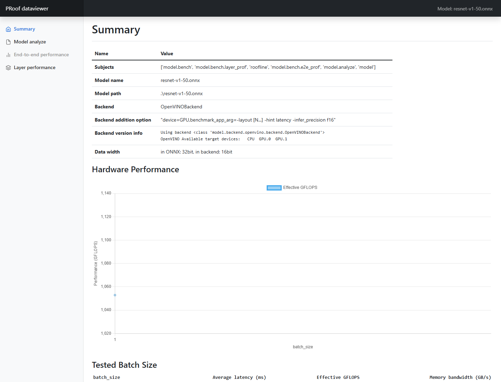
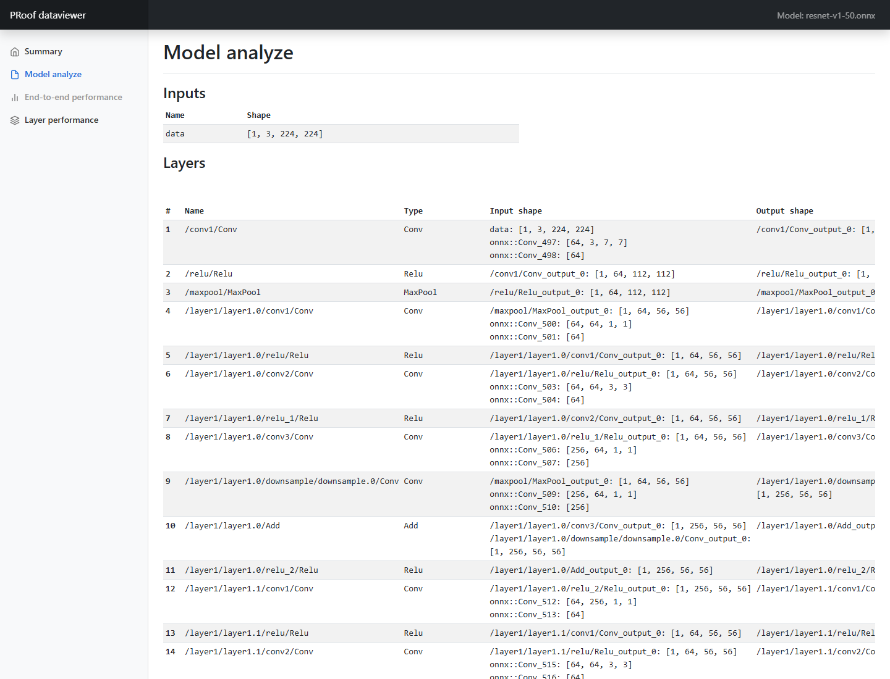
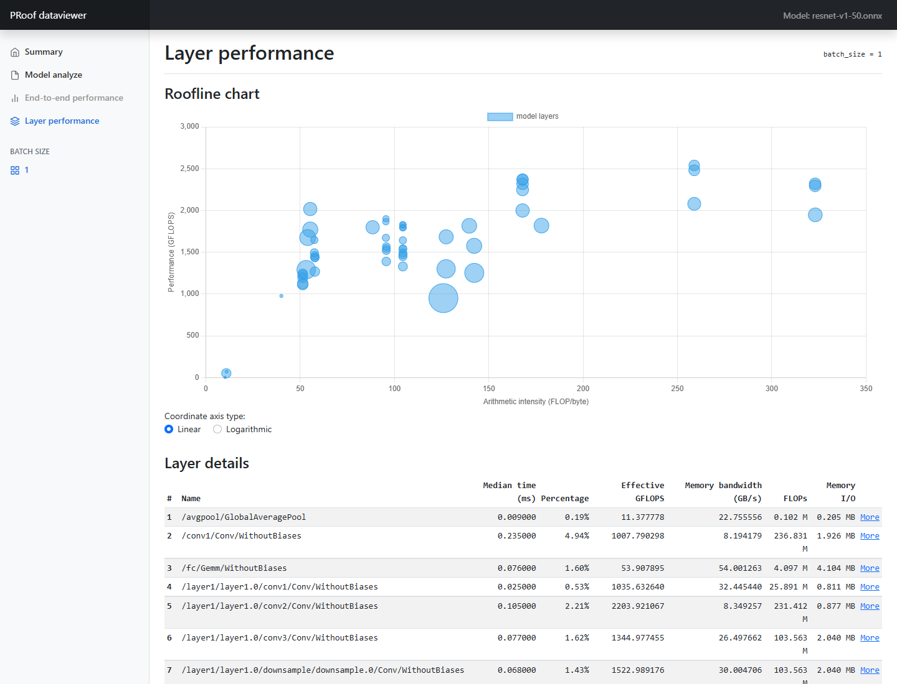

# PRoof-OpenVINO-Results

This repository presents a representative PRoof report for ResNet-50 inference through the OpenVINO GPU backend. Its scope is intentionally limited to the collected ResNet-50 experiment and the generated PRoof views. It is not an extension of the associated GSoC OpenVINO/GTPin project.

## Experiment scope

- Model: `resnet-v1-50.onnx`
- Runtime backend: OpenVINO 2024.0.0
- Device selection: OpenVINO `GPU`
- Batch size: 1
- ONNX data width: FP32
- Requested backend inference precision: FP16
- Performance hint: latency
- Roofline calibration: PRoof small synthetic model

The collected run reported:

- ResNet-50 average latency: approximately 7.59 ms
- ResNet-50 effective performance: approximately 1,079.23 GFLOP/s
- ResNet-50 estimated effective bandwidth: approximately 12.48 GB/s
- Profiled OpenVINO backend layers: 58
- Calibrated compute ceiling: approximately 1.412 TFLOP/s
- Calibrated memory-bandwidth ceiling: approximately 91.18 GB/s

These results describe this particular software, device, precision, and runtime configuration. They should not be treated as general hardware specifications.

## Viewing the report

The report entry point is [`results/resnet50-openvino-gpu/index.html`](results/resnet50-openvino-gpu/index.html).

Because the generated pages load some JavaScript and CSS dependencies from public CDNs, serve the repository locally for the most reliable navigation:

```powershell
python -m http.server 8000
```

Then open:

```text
http://localhost:8000/results/resnet50-openvino-gpu/
```

The report includes:

- an end-to-end summary;
- an ONNX model-analysis table;
- a layer-wise OpenVINO backend profile;
- a bubble-style roofline view in which position represents arithmetic intensity and attained performance, while bubble size reflects execution-time contribution;
- the structured PRoof JSON report and execution log used to generate the views.

## Report previews

Each screenshot below links to the corresponding interactive HTML view in this repository.

### Run summary

[](results/resnet50-openvino-gpu/index.html)

The summary records the model, backend configuration, precision, calibrated hardware performance, and tested batch size.

### ONNX model analysis

[](results/resnet50-openvino-gpu/model.html)

The model-analysis view lists the ONNX graph nodes, operation types, inputs, outputs, and inferred tensor shapes.

### OpenVINO layer roofline

[](results/resnet50-openvino-gpu/layer-1.html)

The layer-performance view places profiled OpenVINO backend layers by arithmetic intensity and attained performance; bubble size represents execution-time contribution. The table below the chart provides the corresponding per-layer measurements.

## Attribution

The profiling framework and generated viewer originate from:

> Siyu Wu, Hailong Yang, Xin You, Ruihao Gong, Yi Liu, Zhongzhi Luan, and Depei Qian. “PRoof: A Comprehensive Hierarchical Profiling Framework for Deep Neural Networks with Roofline Analysis.” ICPP 2024. https://doi.org/10.1145/3673038.3673116

- Original repository: https://github.com/PRoof-framework/PRoof
- Paper DOI: https://doi.org/10.1145/3673038.3673116

All credit for PRoof, its analysis methodology, and its generated viewer templates belongs to the original authors. This repository contains experiment outputs for demonstration and discussion; it does not claim authorship of PRoof.

## Repository purpose

This repository exists to give mentors and collaborators a concrete, reproducible view of PRoof’s OpenVINO output instead of only linking to the paper. It is deliberately separate from the GSoC profiling project and does not incorporate or present GSoC/GTPin implementation work.

## Licensing note

The upstream PRoof repository does not currently declare an open-source license. Accordingly, this repository does not redistribute the PRoof source tree and does not assert a new license over upstream-derived generated viewer assets. Consult the original authors before reusing or modifying those assets beyond this results showcase.
